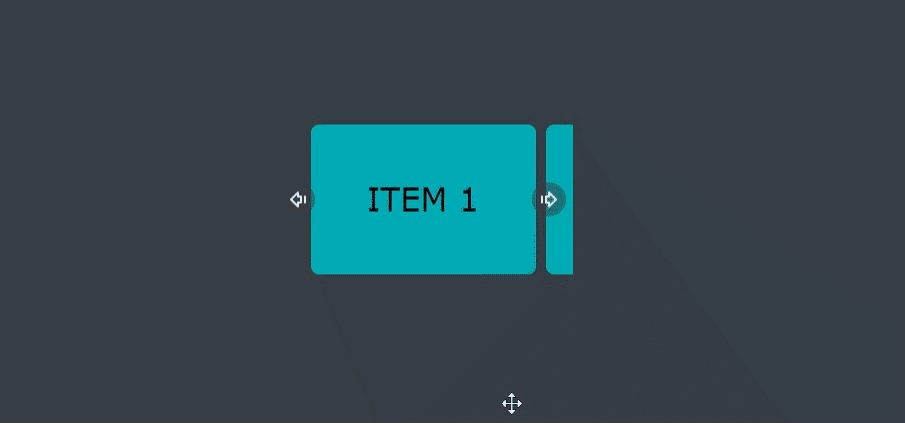
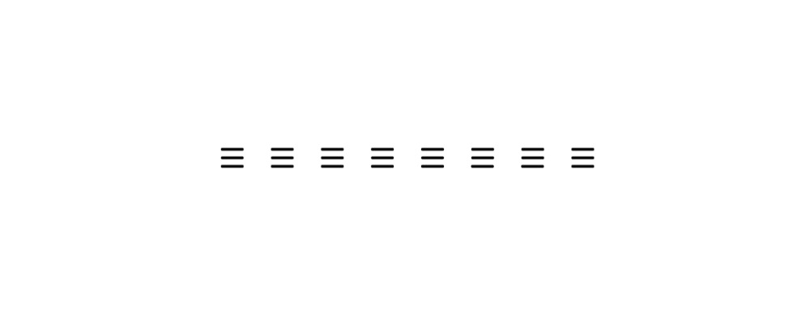

  <h1><b><i>🌐 Awesome Web Elements Showcase</i></b></h1>

 

---

Welcome to the **Awesome Web Elements Showcase**, your go-to resource for exploring and learning about captivating website elements and how they are crafted. This repository is a treasure trove of **inspiration** and **education**, designed to help **novice developers** elevate their web design and development skills.

---

Feel free to further customize this styled description to your liking, and adapt it to the specific elements and goals of your repository.

 

---

 

## Table of Contents
- [Carousel](#carousel)
- [Single hamburger menu](#single_menu)
- [Multiple hamburger menus](#multiple_menu)
- [Alarm animation](#alarm_animation)
- more...

  

---

## 1. Carousel 

  

A seamless carousel element designed for easy item exploration. It smoothly loops back to the beginning after reaching the end.
## 2. Single hamburger menu

  

An elegant single hamburger menu with a precise left-pointing arrow animation.

## 3. Multiple hamburger menus

  

A collection of eight menu icons that transition gracefully from a hamburger menu to a closing icon.

## 4. Alarm animation

  

An animated clock icon that disappears and reappears with a stylish animation when clicked.

## more ...

There is much more content in this repo. Check it out.